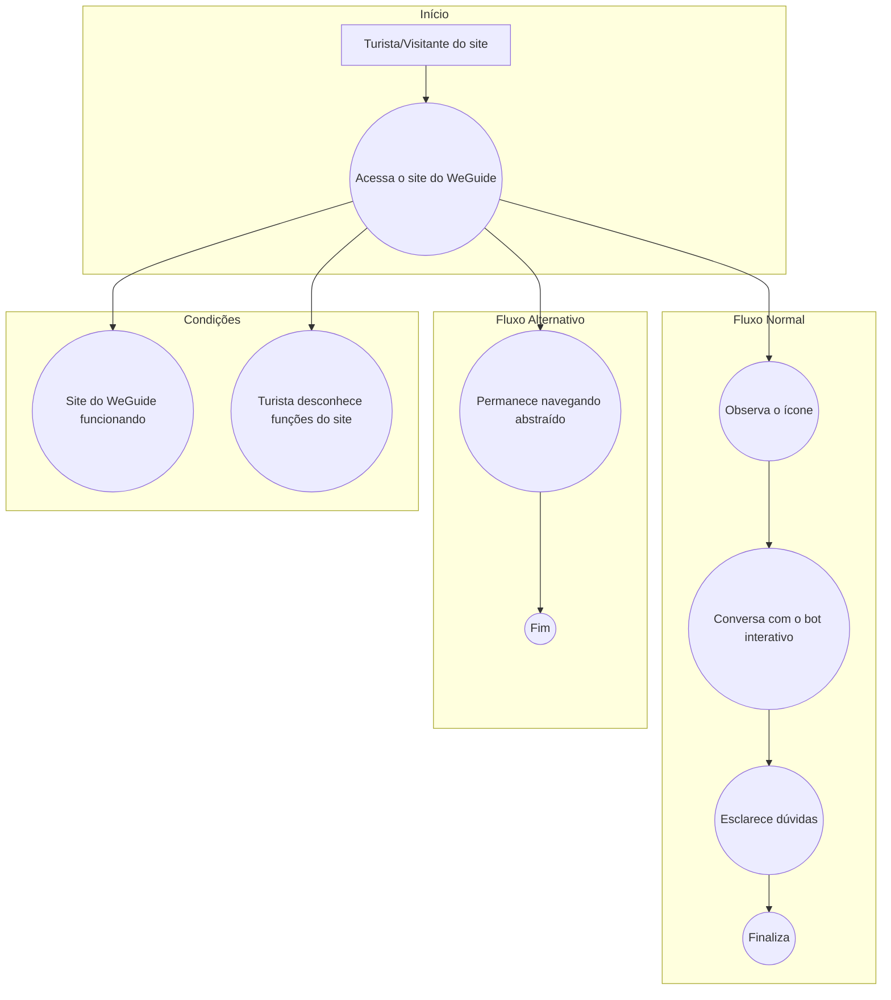

```mermaid
graph TD

subgraph Início
    A[Turista/Visitante do site] --> B((Acessa o site do WeGuide))
end

subgraph Fluxo Normal
    B --> C((Observa o ícone))
    C --> D((Conversa com o bot interativo))
    D --> E((Esclarece dúvidas))
    E --> F((Finaliza))
end

subgraph Fluxo Alternativo
    B --> G((Permanece navegando abstraído))
    G --> H((Fim))
end

subgraph Condições
    B --> I((Site do WeGuide funcionando))
    B --> J((Turista desconhece funções do site))
end

```
