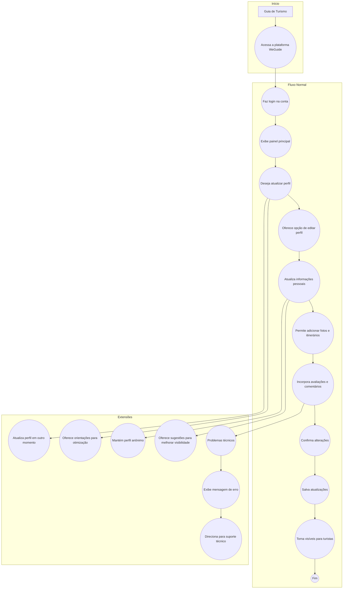

```mermaid

graph TD

subgraph Início
    A[Guia de Turismo] --> B((Acessa a plataforma WeGuide))
end

subgraph Fluxo Normal
    B --> C((Faz login na conta))
    C --> D((Exibe painel principal))
    D --> E((Deseja atualizar perfil))
    E --> F((Oferece opção de editar perfil))
    F --> G((Atualiza informações pessoais))
    G --> H((Permite adicionar fotos e itinerários))
    H --> I((Incorpora avaliações e comentários))
    I --> J((Confirma alterações))
    J --> K((Salva atualizações))
    K --> L((Torna visíveis para turistas))
    L --> M((Fim))
end

subgraph Extensões
    E --> N((Atualiza perfil em outro momento))
    E --> O((Oferece orientações para otimização))
    G --> P((Mantém perfil anônimo))
    G --> Q((Oferece sugestões para melhorar visibilidade))
    I --> R((Problemas técnicos))
    R --> S((Exibe mensagem de erro))
    S --> T((Direciona para suporte técnico))
end

```
